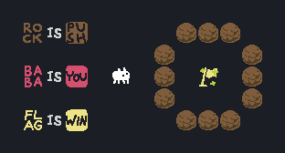

[](https://travis-ci.org/MarcinKonowalczyk/baba?branch=master)

# baba
Simplified implementation of [Baba Is You](https://hempuli.com/baba/).

This is a work-in-progress project. The intended scope, however, is as follows:

- 4 possible entities: `Baba`, `Wall`, `Flag`, `Rock` (uppercase)
- 4 corresponding nouns (lowercase)
- 3 properties: `push`, `win` and the pronoun `you`
- Operator `is`
  
Overall this gives 12 possible grid states + empty (13 overall).

## Rules

As compared to the original, the following interactions are simplified in this version:

- Entities cannot overlap. Effectively everything is `stop`. This *should* prevent the game from becoming too broken and makes programming easier. While still allowing for interesting things to happen.
- No idle nor undo actions.

The following, however, are supposed to work:

- Noun is Noun. Something like `baba is wall`, for example.
- NounA is NounA overruling the behaviors of NounA is NounB. For example if `wall is wall`, `wall` cannot be `baba`. The rule `wall is baba` can exist but it does nothing.
- Text is implicitly push.

## Gameplay

The game is played by providing a sequence of actions. The allowed actions are `up`, `down`, `left` and `right`. The game is won when 1) an entity which is `you` attempts to enter (since everything is `stop`) the square with another entity which is `win` , or 2) the entity which is `you` is also `win`. Note, that if a flag which is `push` and `win` is pushed, `you` don't win, unless it is pushed against a wall, in which case it is stuck and you do in fact win.

The order of operation of each turn is as follows:
  
- Search the grid for all the current rules
- Parse the rules into behaviours and transformations.
- Apply all the transformations to the grid
- Perform an action for the turn according to the behaviours
  
This is done for each of the steps in a sequence. The game stops if the win condition is reached at any point, or if further play is unnecessary because nothing is `you` (effectively a loss).

## Examples

The gifs in this section have been generated with `animate\animate.py` and the accompanying IPython notebook.

Flag is already win, so all baba needs to do is to attempt to walk on it. `>>>>` wouldn't work because in this version everything is stop. Hence `>>^>>V`:



In a similar manner, fastest loss can be achieved by breaking the `Baba is You` rule with `<^<V`:


### Winning with rocks

Somewhat more creative win can be achieved by making `Rock if Baba` and walking onto the flag. This can be done with `<^^^<<V^>>VV<<>>`:


Similarly, `Rock` can be made into `You` with `<^^^<<V^<<VV>><<^>><<`. Note that the last few moves could not be made to the right because `Baba`, who is also `You` would have broken the `Rock is You` rule after one step.


The sequence `<VVV<^<^>V>^^V<<<<^^^>^>>>>VVV<^>>>` makes `Rock` into a `Win` instead:


## ToDo's

- [x] Actually meet the scope
- [x] Write a nice renderer of a game (make a gif of it, for example)
- [ ] Write an tiny codegolf version. _Given a sequence of moves, does it win on a standardised level?_ For this it might be best to make a smaller level with just `Baba`, `Flag` and `Rock`. Maybe something like that(?):

```
. . . . . . . . . . . . .
. r i p . . . . R R R . .
. . . . . . . R . . . R .
. b i y . B . R . F . R .
. . . . . . . R . . . R .
. f i n . . . . R R R . .
. . . . . . . . . . . . .
```

### Also

- Actually put things into classes?
- Hook up coveralls?

